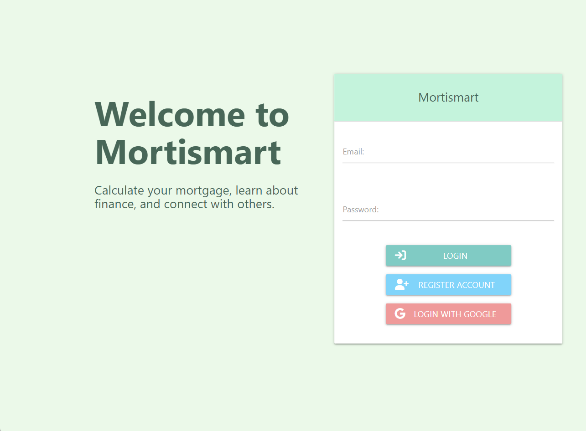
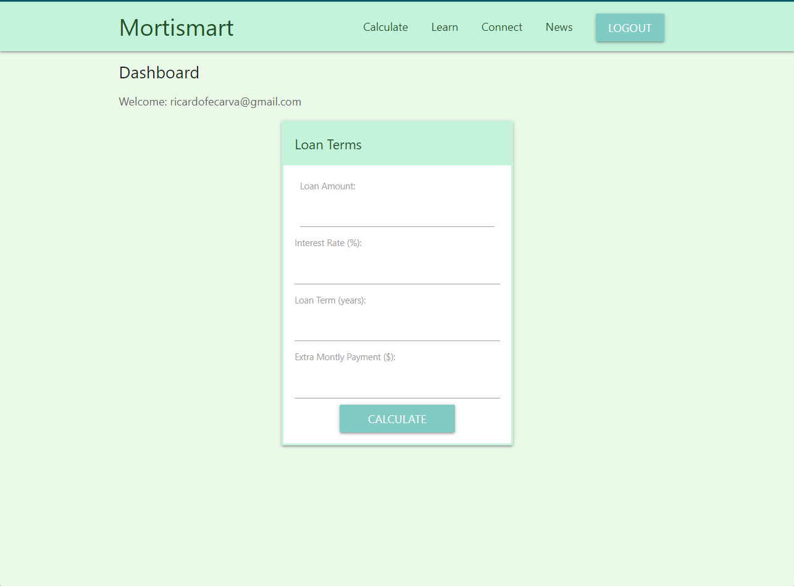
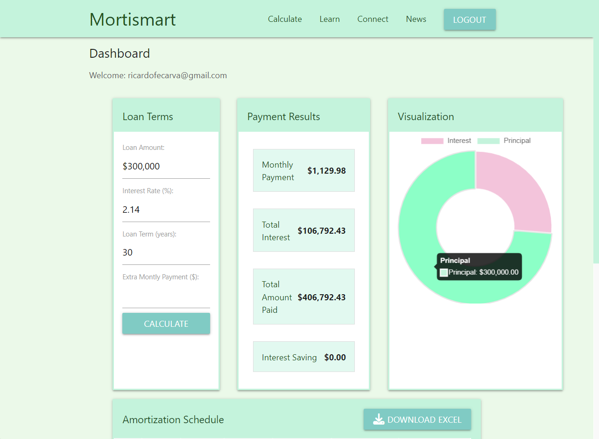
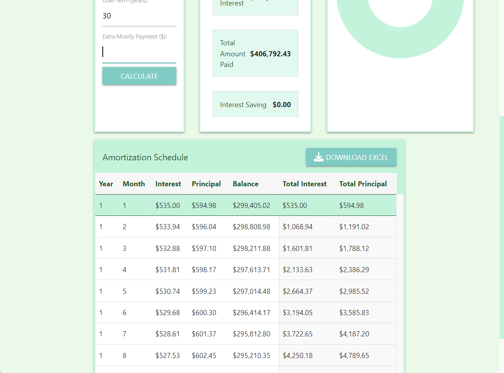
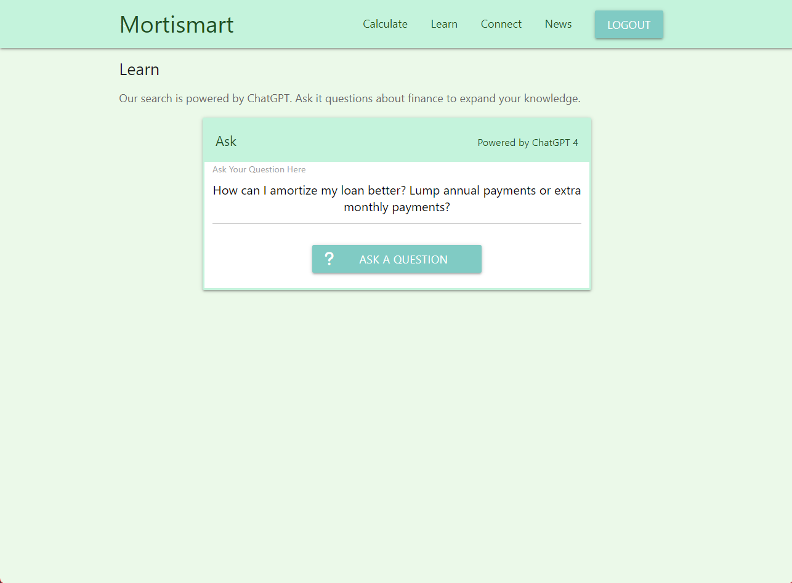
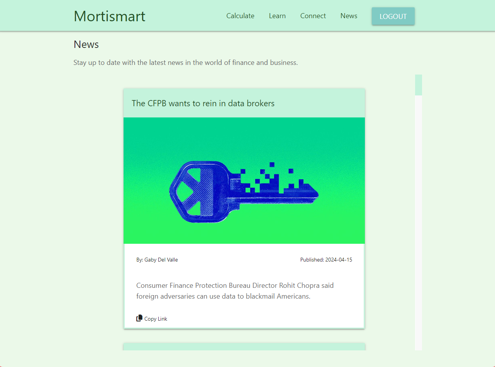

# MortiSmart
An easy to use Mortage Calculator.

## Main Capabilities

### Authentication
Provides secure access to user accounts using OAuth

### Mortgage Calculation

Allows users to calculate mortgage payments based on various inputs like loan amount, interest rate, and loan tenure.

### Amortization Schedule
Offers a detailed schedule showing the amounts of principal and interest that make up each mortgage payment throughout the loan term.

### Impact of Additional Payments
Users can simulate how making extra payments may affect their mortgage schedule and total interest paid.

### Data Visualization
Features graphical representations of data to help users understand their mortgage calculations and impacts visually.

### Learn - Powered by ChatGPT
Incorporates an AI-powered assistant to provide educational content and answers to user queries regarding mortgages.

### Connect Forum
Includes a community forum where users can discuss and share advice on mortgage-related topics.

### News
Keeps users updated with the latest news related to mortgages and housing markets.

## [Watch our demo video!](https://www.youtube.com/watch?v=bU_wWT6y4Oo)

## Get Started
1. clone project
2. `cd` into project directory
3. run `npm install` to install dependencies
4. rename `config/example_config.env` to `config/config.env` and add your information and api keys.
5. run `npm run dev` to start server

make sure you setup your config.env with your own api and database keys.

want to run webpack to rebundle?
`npx webpack --mode production`

To run automated tests, run: ```npm run test:limited``` or ```npm run test:test:full```. 

This will check coverage for all .js files or just some .test.js files.

## Images

### Login 



### Dashboard





### Learn


### Forum


### News

